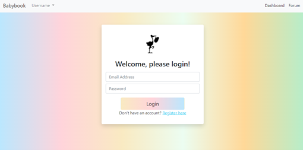
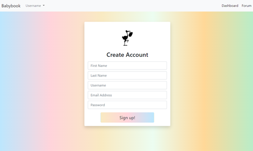

# Baby-Forum-Project-2

## Description 

Having a baby? Already have a baby or kids? We created an app for new/current parents to be able to become a community and talk amongst one another in threads with topics that other parents have created. When you are signed up you can comment and create your own topics and view your dashboard with family information. The user can add their babies to the dash board and schedule appoints such as doctor appointments, play dates, and extracurricular activities for their child.

Link to heroku web page ()
Link to deployed app on Github ()

# Table of Contents 
- [User Story](#UserStory)
- [Usage](#Usage)
- [Installation](#Installation)
- [Credits](#Credits)
 

## User Story
As a parent I want to view advice from other experienced parents,
I want to be able to ask questions to other parents as well as be able to share my thoughts and experiences.

## Usage

WHEN I open the app,
I WANT to login or be able to register as a new user then be redirected to my dashboard once logged in.
I WANT TO view my family then register my baby.
I WANT TO be able to track doctor appointments, playdates. and baby's development with milestones. 
I WANT TO view my appointments to prepare for the day or upcoming appointments/playdates
I WANT TO be able to view close family THEN I can add or remove members.
I WANT TO be able to click on the forum in a nav bar THEN be redirected to a forum page.
I WANT TO view threads created by users and their comments.
I WANT TO create a new thread with a title and content information of that topic THEN have other users to be able to comment on that specific thread.

[Demo Video](./public/assets/demo.mp4)

## Installation

1. Clone the Github repo. 
2. `npm i` to install packages. (bcrypt, connect-session-sequelize, dotenv, expres, express-handlebars, express-session, mysql2, nodemailer, nodemon, sequelize).
3. Access your Mysql in your terminal by inputting `mysql -u root -p` and input your password. 
4. Once in your mysql type `source db/schema.sql`.
5. Type quit to exit mysql.
6. `npm run seed`
7. `npm start` to view in localhost.

## Credits
- [lzvalentin](https://github.com/lzvalentin)
- [amiramonte](https://github.com/amiramonte)
- [kearac-hub](https://github.com/kearac-hub)
- [zortro](https://github.com/zortro)
